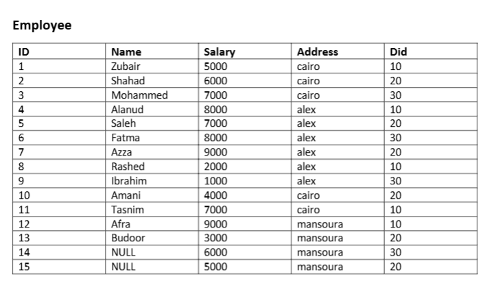
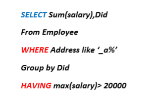
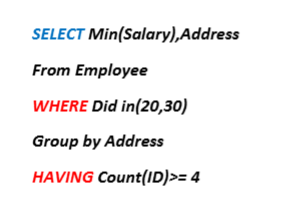

The WHERE and HAVING Task 
----------------------------------

Solve:

|Did|Total salary|
|----|-----------|
| 10    |   21000 |

----------------------------

solve:

|Min salary |address|
|-----------|-------|
|1000       |alex