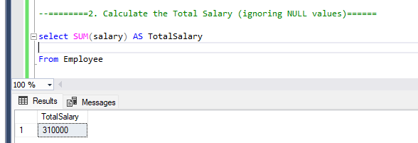

# Aggregate Functions

1. Count the Total Number of Employees

-------------------------

2. Calculate the Total Salary (ignoring NULL values) 

---------------------
3. Find the Average Salary 

-----------------------
4. Find the Highest and Lowest Salary

-----------------------
============GROUP BY============

Example 1: Group By Single Column (Employee name with 
total salary)

-----------------------
Example 2: Group By Multiple Columns (Student subject and 
year)

-----------------------
==================HAVING==================

Example 1: Departments with total salary ≥ 100,000 

-----------------------

Example 2: Subjects with more than 1 student in any year 

-----------------------
